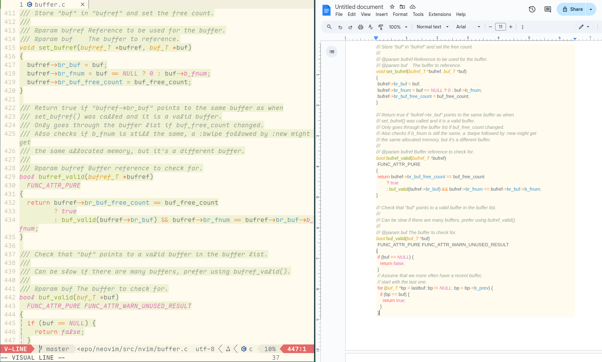

# Richclip

Clipboard provider for Neovim with rich features.

The plugin can be used as the normal provider like [xclip](https://github.com/astrand/xclip),
[xsel](https://github.com/astrand/xclip) or [wl-clipboard](https://github.com/bugaevc/wl-clipboard)
with extra features:

- Copy highlighted source code with Neovim color scheme to the clipboard.
- Copy text from Neovim buffer with specific mime-type into the clipboard.
- Paste content with all kinds of mime-types, not only `text/plain`, from
  clipboard to Neovim.
  
 
 
## Installing

The plugin requires [richchip](https://github.com/beeender/richclip) command
line utility to be installed. The plugin will try to download the utility if
necessary. Or it can be installed separately.
See [richchip#install](https://github.com/beeender/richclip?tab=readme-ov-file#installing).

### lazy.nvim

```lua
{
    'beeender/richclip.nvim',
    config = function() require("richclip").setup() end
}
```

## Options:

```lua
require("richclip").setup({
    --- Specify the richclip executable path. If it is nil, the plugin
    --- will try to download it to 'plugin_dir/bin' automatically.
    --- The plugin tries to search for the executable in:
    --- 'richclip_path' if it is set, '$PATH', 'plugin_dir/bin'.
    richclip_path = nil
    --- Set g:clipboard to let richclip take over the clipboard.
    set_g_clipboard = true
    --- To print debug logs
    enable_debug = false
})
```

## Usage

### Copy the highlighted code

By default, `richchip.nvim` will set itself as the Neovim clipboard provider,
`"+y` (or other hotkeys set by users) will copy the current selection to the
clipboard in both `text/plain` and `text/html` format. So the paste client, like
a word processor, can choose the preferred format to use.

### Copy the content with specific mime-type

`RichClip copy <mime-type>` can copy the give range of text, of the whole
current buffer into the clipboard with the give mime-type. So the paste client
can treat it differently than `text/plain`. For example:

```
:'<,'>RichClip copy text/html
```

### Paste different types content from clipboard

`RichClip paste <mime-type>` can paste the specific type of content from
clipboard into the current buffer location. For example, the copy operation on a
browser page could lead to two contents in the clipboard, one is in plain text,
the other with the HTML code. `RichClip paste`'s completion list can indicate
what types are existing in the clipboard, and paste it into the current buffer.

```
:RichClip paste text/html
```
